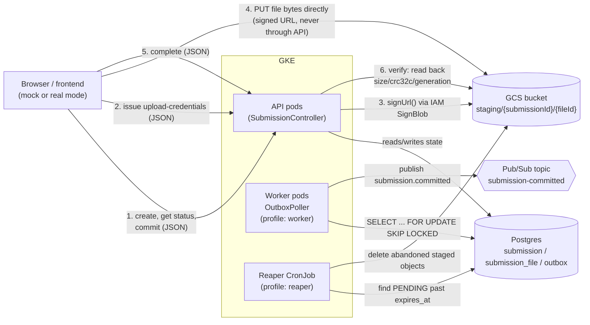
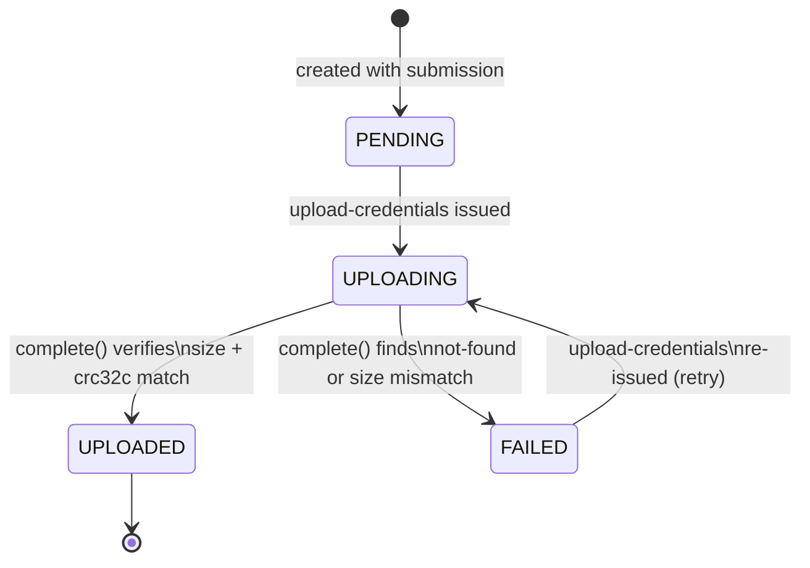
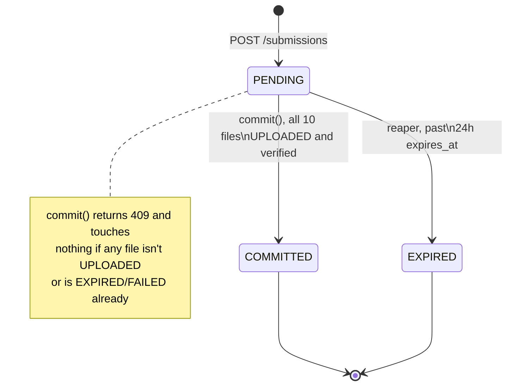
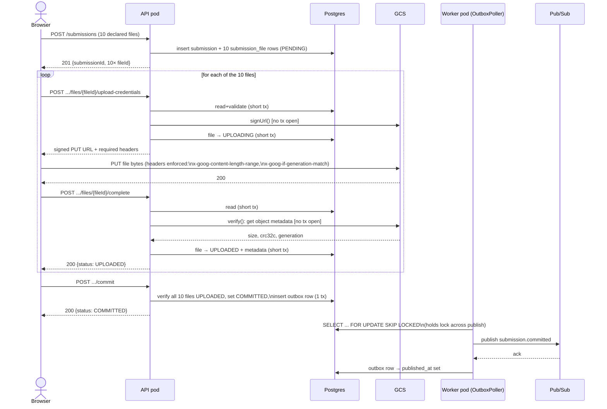
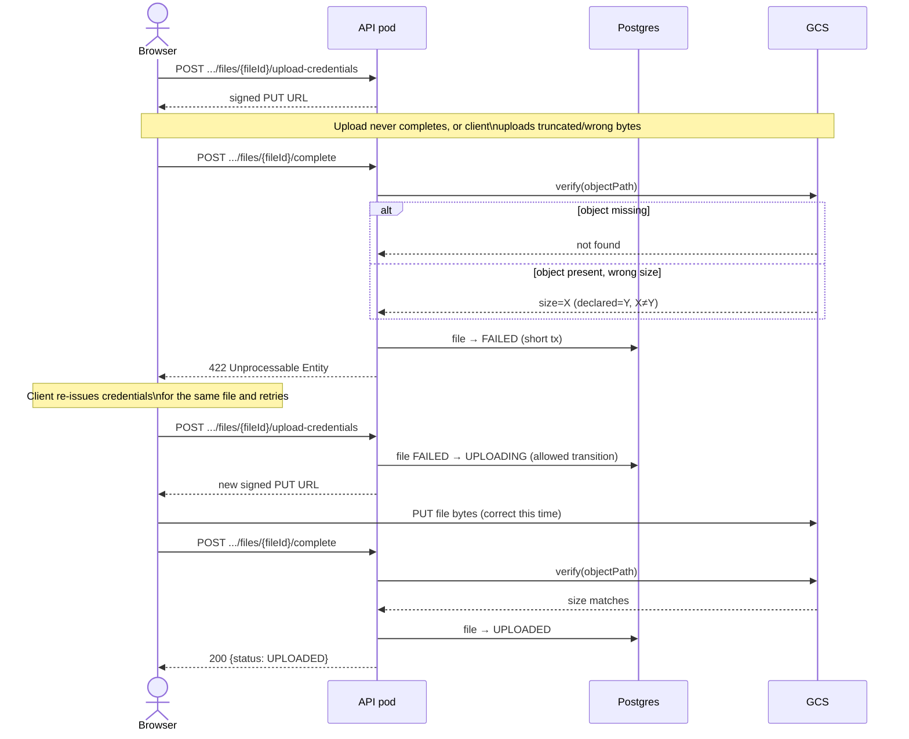
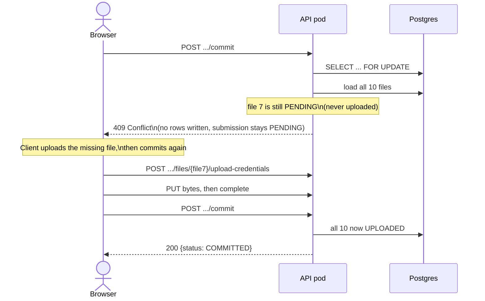
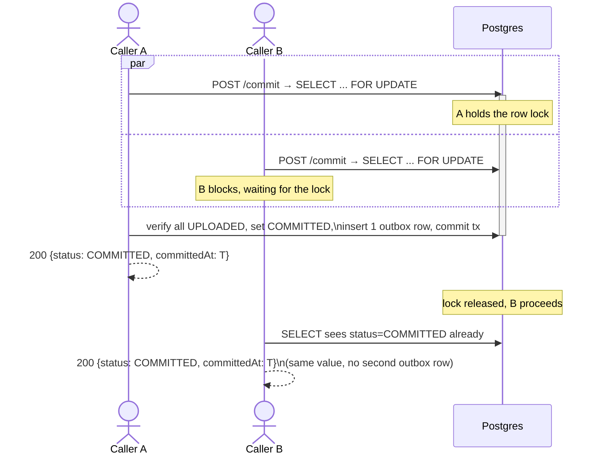
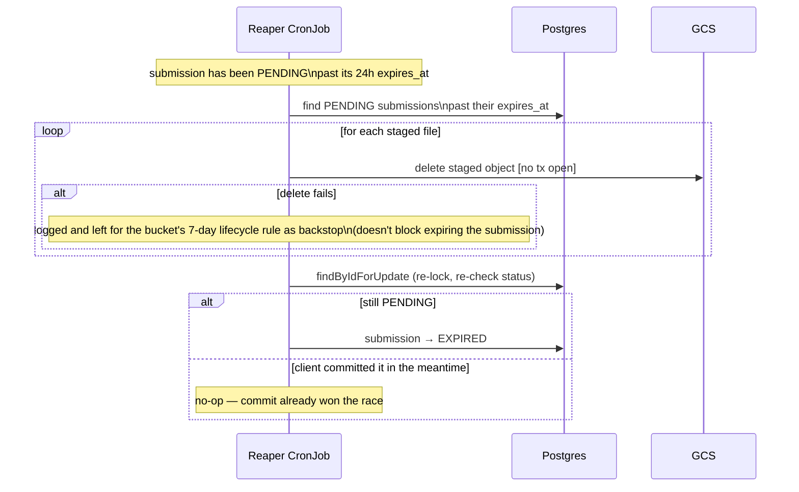
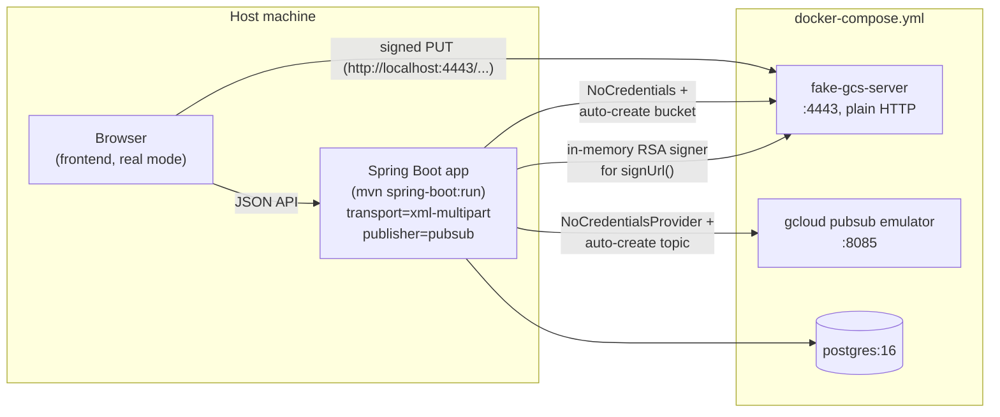

# Diagrams

Visual companion to [architecture.md](architecture.md) (why) and [specification.md](specification.md) (what was asked for). GitHub renders the Mermaid blocks below inline.

- [System architecture](#system-architecture)
- [Status state machines](#status-state-machines)
- [Success path: full submission lifecycle](#success-path-full-submission-lifecycle)
- [Failure: upload verify fails, client retries](#failure-upload-verify-fails-client-retries)
- [Failure: commit attempted with files not all uploaded](#failure-commit-attempted-with-files-not-all-uploaded)
- [Edge case: concurrent double commit](#edge-case-concurrent-double-commit)
- [Failure: submission abandoned, reaper expires it](#failure-submission-abandoned-reaper-expires-it)
- [Local GCP emulation topology](#local-gcp-emulation-topology)

## System architecture

The core invariant — **file bytes never transit the application** — shapes everything else: API pods only ever exchange small JSON payloads and short-lived signed URLs; the browser talks to GCS directly for the bytes themselves.

## Status state machines

Two independent state machines: one per file, one per submission. Commit re-checks every file's status rather than trusting `/complete` blindly.

## Success path: full submission lifecycle

One file's upload/complete cycle shown; in practice all 10 run through this loop (concurrency-capped in the frontend) before commit is enabled.

## Failure: upload verify fails, client retries

Covers both sub-cases `/complete` treats as the same outcome: the object never landed in GCS (`404`-equivalent `notFound()`) and the object landed but at the wrong size. Either way the file — and only that file — goes to `FAILED`; the other 9 are untouched and the submission stays `PENDING`.

## Failure: commit attempted with files not all uploaded

Commit does no I/O and touches no file rows on this path — the submission is exactly as re-triable after a 409 as it was before the attempt.

## Edge case: concurrent double commit

Two callers race the same submission's commit. Correctness comes from the Postgres row lock, not application logic — the second caller blocks until the first's transaction commits, then sees `COMMITTED` and no-ops.

## Failure: submission abandoned, reaper expires it

Runs as a `@Profile("reaper")` k8s CronJob, not `@Scheduled` inside the API pods — a one-shot process that exits when done. Re-locks and re-checks status before writing, so a submission the client legitimately committed in the window between the reaper's read and its write is never clobbered back to `EXPIRED`.

## Local GCP emulation topology

The `docker-compose.yml` stack used to exercise the real `XmlMultipartTransport`/`PubSubOutboxPublisher` code without a GKE cluster or GCP account (see [architecture.md](architecture.md#local-gcp-emulation-no-gkegcp-account-needed)). The app itself runs on the host (`mvn spring-boot:run`), not inside compose, for fast dev iteration.

